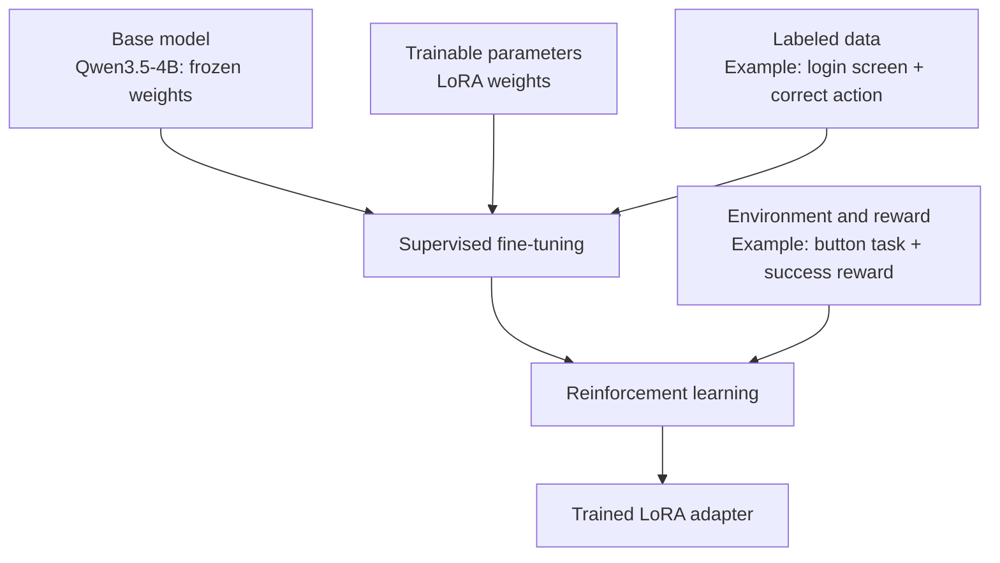
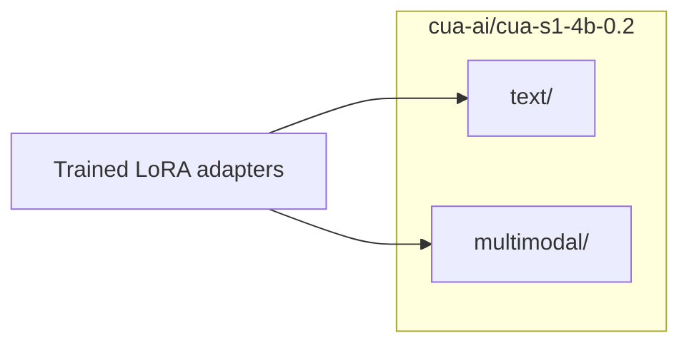
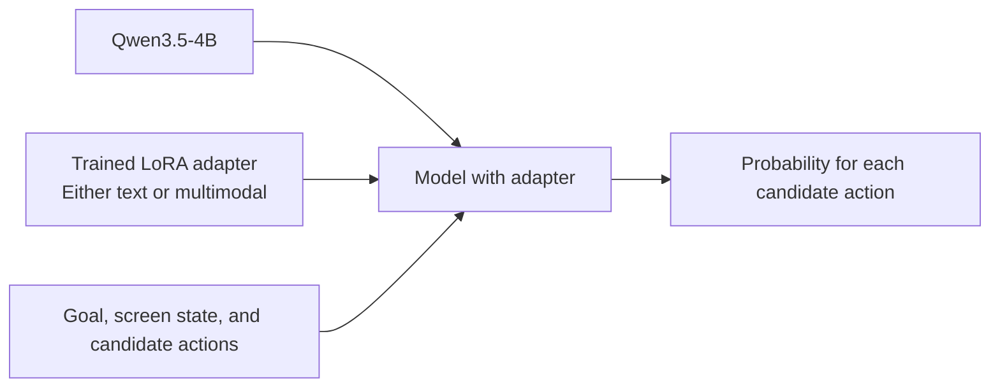

# Learning `cua-ai/cua-s1-4b-0.2`

A learning repository for exploring how [`cua-ai/cua-s1-4b-0.2`](https://huggingface.co/cua-ai/cua-s1-4b-0.2) uses LoRA adapters with Qwen3.5-4B to score candidate GUI actions. It includes a local inference example for Apple Silicon Macs and notes on model training, adapter distribution, and inference.

## Usage

Install [mise](https://mise.jdx.dev/getting-started.html) before running these commands. mise manages Python, uv, and just; uv manages the project dependencies and virtual environment. just provides commands for dependency setup, environment checks, and inference.

```sh
mise trust
mise install
just setup
```

Run inference:

with text:

```sh
just run
```

with screenshot:

```sh
just run --screenshot example/ui.shadcn.com-blocks-login.png
```

The sample screenshot shows an empty login form with `Login` and `Login with Google` buttons.
The current code uses a completed-form goal and fixed `Sign in` / `Cancel` candidates; these need adjustment to match the sample.

---

## Development

Lint and check formatting:

```sh
just lint
```

Apply lint fixes and formatting:

```sh
just format
```

---

## `cua-ai/cua-s1-4b-0.2`

### Model lifecycle

#### Training



| Component | Example | Role |
| --- | --- | --- |
| Base model | Qwen3.5-4B | Foundation with frozen weights |
| Trainable parameters | Additional LoRA weights | Parameters updated during training |
| Labeled data | Login screen + "click the submit button" as the correct action | Examples for supervised fine-tuning |
| Environment and reward | GUI button task + reward for completion | Interaction and feedback for reinforcement learning |

Training data and environments documented by the project:

| Data or environment | Content | Usage in 0.2 |
| --- | --- | --- |
| [crossdataset_hard_v2](https://github.com/trycua/cua/tree/main/libs/cua-bench-s1#results) | Screen states, candidate actions, and correct labels | Reported supervised fine-tuning split, including `safety_gate` tasks |
| [Synthetic GUI data](https://github.com/trycua/cua/blob/main/libs/cua-bench-s1/python/src/cua_bench_s1/datagen/generator.py) | Generated GUI tasks such as forms, login, and safety decisions | Source of `safety_gate` tasks; other synthetic contributions not specified |
| [AndroidControl](https://github.com/google-research/google-research/tree/master/android_control) | Mobile app screenshots, accessibility trees, and recorded actions | Project data source for GUI training tasks; exact contribution to the 0.2 split not specified |
| [cua-bench-basic](https://github.com/trycua/cua/tree/main/libs/cua-bench/datasets/cua-bench-basic) | Interactive GUI tasks and task-completion rewards | Reinforcement learning on task variants 0–1; evaluation on variants 2–4 |


#### Distribution



| Component | Example | Role |
| --- | --- | --- |
| Repository | [cua-ai/cua-s1-4b-0.2](https://huggingface.co/cua-ai/cua-s1-4b-0.2) | Publication and download location for trained adapters |
| Text adapter | `text/` | Additional weights and configuration for decisions based on screen text |
| Multimodal adapter | `multimodal/` | Additional weights and configuration for decisions based on screenshots |
| Weights file | `adapter_model.safetensors` in each directory | Trained LoRA weights |
| Configuration file | `adapter_config.json` in each directory | Base model name, LoRA target layers, and other settings |

#### Inference



```text
CuaModel.load()
├─ Base model loading
│  └─ Original Qwen3.5-4B weights W
│
└─ PeftModel.from_pretrained(model, adapter_path)
   ├─ Loading adapter_config.json
   │  └─ LoRA target layers, scaling, and other settings
   ├─ Addition of LoRA computation paths to target layers
   └─ Loading adapter_model.safetensors
      └─ Assignment of trained weights A and B

Model inference
└─ Computation in each layer with LoRA
   ├─ Base computation: W × input
   ├─ LoRA computation: scale × B × A × input
   └─ Sum of both results → input to the next layer
```

| Component | Example | Role |
| --- | --- | --- |
| Base model | Qwen3.5-4B | Same foundation used during adapter training |
| Trained adapter | `text/` or `multimodal/` | Additional weights trained for GUI action decisions |
| Adapter loading | `PeftModel.from_pretrained` in [PEFT](https://huggingface.co/docs/peft/index) | Integration of additional weights into the base model |
| Input | Login goal, screen state, and Sign in / Cancel candidates | Information for selecting the next action |
| Output | Probabilities for Sign in and Cancel | Selection probabilities over the supplied candidates |

#### Terminology

- LoRA (Low-Rank Adaptation)
    - A method for training only additional weights while keeping base weights frozen
    - Distribution of trained weights as an adapter for use with the same base model

### Cua-S1 vs. Jev

Is Cua-S1 worth using instead of Jev for GUI action selection?

Selected results from [Cua's benchmark](https://github.com/trycua/cua/tree/main/libs/cua-bench-s1#results): text-only GUI-360 hard cross-dataset evaluation, 615 tasks overall. Task accuracy requires every element to be correct.

| Task family | Jev | Cua-S1-4B-0.2 |
| --- | ---: | ---: |
| Consent checkbox | 0.0% | 83.3% |
| Form filling | 57.6% | 93.9% |
| Login authentication | 8.3% | 100.0% |
| Multi-step submission | 3.4% | 86.7% |
| Search and filtering | 2.1% | 95.8% |

These are Cua's published results, not local measurements; the table does not specify the Jev version. They do not establish screenshot performance or superiority over current Jev. Local accuracy, speed, and the benefit of image input remain unverified.
